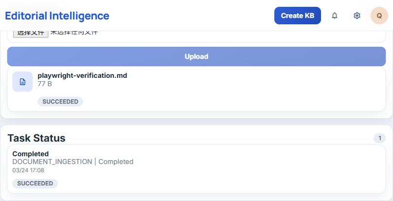
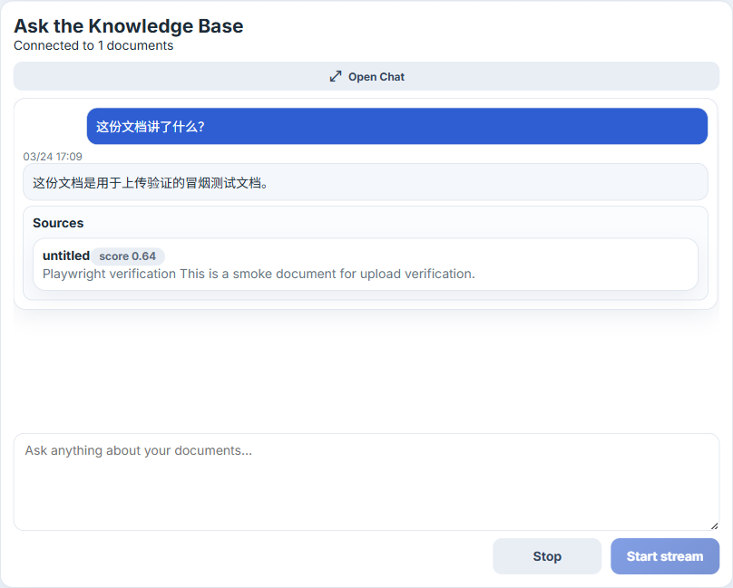
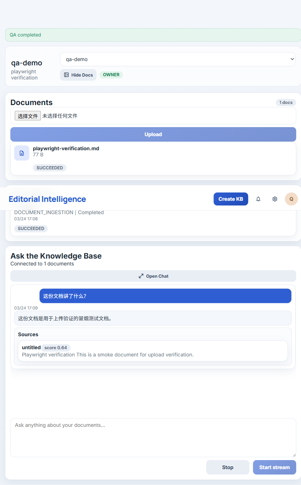

# My Knowledge Base | AI知识库问答平台

<p align="center">
  
  
  
  
</p>

> 基于 `Spring Boot + React/Vite + Dify` 的 AI 知识库问答平台，打通 `登录 -> 创建知识库 -> 上传文档 -> OCR/Dify 入库 -> 问答` 的完整业务闭环。

## 项目定位

这是一个面向实际交付的 `AI engineering`（AI 工程化，中文解释：围绕真实业务流程构建的工程项目）项目，不是简单聊天壳。

- 面向场景：企业知识库、文档问答、内部资料检索
- 核心价值：让文档上传、入库、检索、问答形成可验收闭环
- 当前状态：本地联调已通过，主链路可用，适合演示和继续扩展

## 当前进度

- 已完成 `Auth`、知识库管理、文档上传、任务状态跟踪
- 已完成 `Dify dataset/document API` 对接
- 已完成 `PDF -> OCR -> Dify` 入库链路
- 已完成 `QA / chat SSE` 问答链路和 `Sources`（来源，中文解释：答案引用依据）展示
- 已完成本地 `Docker` 联调、浏览器验收和截图归档
- 仍待完成：`Linux` 真实宿主机部署演练

## 功能预览

### 1. 创建知识库


### 2. 工作台总览


### 3. 上传入库



### 4. 问答与 Sources



### 5. 完整验收页



## 核心能力

- `JWT auth`：登录注册和接口鉴权
- 知识库创建、列表、详情、共享
- 文档上传到 `LOCAL / MinIO` 存储
- 异步入库任务流转与状态展示
- 自动创建 `Dify dataset`
- 普通文件直传入库
- `PDF -> OCR -> Dify text document` 扫描件链路
- 知识库范围内的 `QA / chat SSE`
- 检索结果和 `Sources` 引用返回
- 失败任务重试、失败文档删除

## 技术栈

- 前端：`React + Vite`
- 后端：`Spring Boot 3.3`
- 运行时：`Java 21`
- 数据库：`PostgreSQL`
- 缓存：`Redis`
- 对象存储：`MinIO`
- AI 核心：`Dify self-hosted`
- OCR：独立 OCR service
- 部署：`Docker + host Nginx`

## 本地启动

本仓库采用 `Hybrid Dev`（混合开发，中文解释：前后端本地跑，基础依赖可本地或容器化）的方式。

### 启动顺序

1. 启动 `Dify`：

```powershell
cd /d D:\services\dify\docker
docker compose up -d --build
```

2. 启动项目后端栈：

```powershell
cd /d D:\Workspace\CodexProject\My_KnowledgeBase
docker compose --env-file deploy\.env -f deploy/docker-compose.yml up -d --build
```

3. 启动前端：

```powershell
cd /d D:\Workspace\CodexProject\My_KnowledgeBase\apps\web
npm install
npm run dev -- --host 0.0.0.0 --port 3001
```

4. 打开页面：

- 前端：`http://localhost:3001`
- 后端健康检查：`http://127.0.0.1:8081/actuator/health`

### 关闭顺序

1. 停项目后端栈：

```powershell
cd /d D:\Workspace\CodexProject\My_KnowledgeBase
docker compose --env-file deploy\.env -f deploy/docker-compose.yml down
```

2. 停 `Dify`：

```powershell
cd /d D:\services\dify\docker
docker compose down
```

3. 关闭前端 `npm run dev` 窗口：

- 按 `Ctrl + C`

完整说明见：
- [predeploy-report.md](docs/project/predeploy-report.md)

## 目录说明

```text
.
|-- apps/
|   |-- server/          # Spring Boot API
|   |-- web/             # React frontend workbench
|   `-- ocr/             # OCR adapter service
|-- deploy/              # deployment files and Nginx config
|-- docs/project/        # project docs, reports, decisions
|-- docs/picture/        # Playwright verification screenshots
|-- scripts/             # local dev, test, build, rehearsal scripts
|-- standards/           # delivery and deployment standards
`-- .runtime/            # local runtime data
```

## 文档链接

- [requirements-summary.md](docs/project/requirements-summary.md)
- [mvp-boundary.md](docs/project/mvp-boundary.md)
- [technical-decision.md](docs/project/technical-decision.md)
- [quality-report.md](docs/project/quality-report.md)
- [predeploy-report.md](docs/project/predeploy-report.md)
- [release-record.md](docs/project/release-record.md)

## 下一步

- 执行 `Linux` 宿主机部署演练
- 视需要补充批量清理 / 批量重试能力
- 如果部署环境受限，继续收敛镜像缓存和构建稳定性
